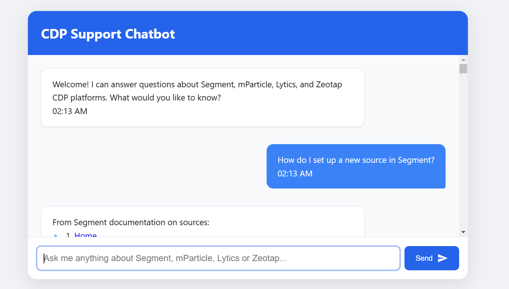

# CDP Support Agent 🤖

[](https://python.org)
[](https://flask.palletsprojects.com)

An intelligent chatbot that answers how-to questions for Customer Data Platforms (CDPs) using real documentation analysis.



## 🛠️ Setup Guide

#### 1. Clone Repository
```bash
git clone https://github.com/manishdusa/support_agent_chatbot.git
cd support_agent_chatbot
```

#### 2. Backend Setup
```bash
# Navigate to backend directory
cd backend

# Create and activate virtual environment
python -m venv venv

# Windows
venv\Scripts\activate
# Mac/Linux
source venv/bin/activate

# Install dependencies
pip install -r requirements.txt
```

#### 3. ChromeDriver Setup
```bash
# Install using built-in manager
python -c "from webdriver_manager.chrome import ChromeDriverManager; ChromeDriverManager().install()"
```

## 🛀 File Structure
```
├── backend/
│   ├── app.py              # Flask server
│   ├── document_scraper.py # Core scraping logic
│   └── requirements.txt    # Python dependencies
├── frontend/
│   ├── index.html          # Chat interface
│   ├── styles.css          # Modern styling
│   └── script.js           # Client-side logic
└── README.md
```

## 🚀 Running the System

#### 1. Start Backend Server
```bash
cd backend
python app.py
# Server starts at http://localhost:5000
```

#### 2. Open Frontend
- Open `frontend/index.html` directly in Chrome
- **Recommended:** Use the Live Server extension in VS Code for better performance

## 💬 Example Queries

| Category        | Example Questions |
|---------------|------------------|
| **Basic Setup** | "How to create a Segment source?"<br>"Setup mParticle user profile" |
| **Troubleshooting** | "Fix 403 error in Zeotap"<br>"Why is my Lytics data not syncing?" |
| **Comparisons** | "Compare Segment vs mParticle events"<br>"Difference between Lytics and Zeotap" |
| **Advanced Features** | "Implement server-side tracking"<br>"Set up real-time data pipelines in Zeotap" |

## 🛠️ Technical Stack

### Backend
- Flask (Web Server)
- Selenium (Browser Automation)
- BeautifulSoup (HTML Parsing)
- Cachetools (Response Caching)

### Frontend
- Vanilla JavaScript
- CSS Flexbox/Grid
- Fetch API


## 📚 License
MIT License - See [LICENSE](LICENSE) for full text.

---

Enjoy using CDP Support Agent! 🛠️💻

